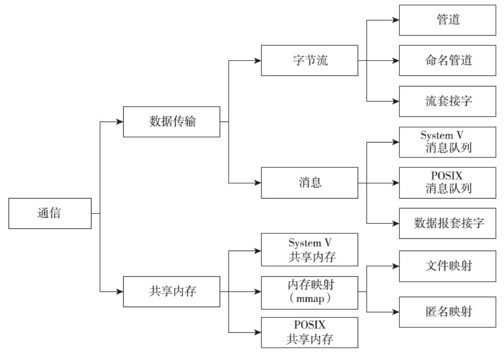
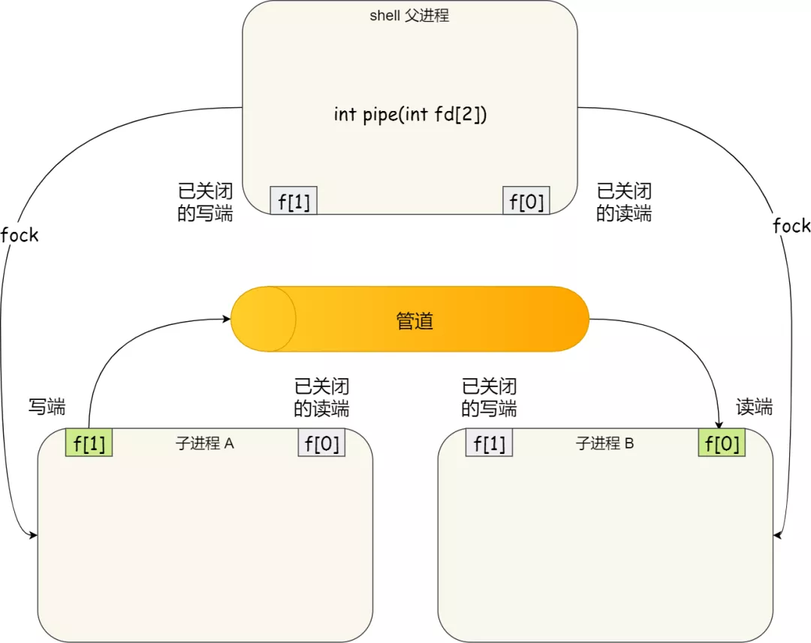
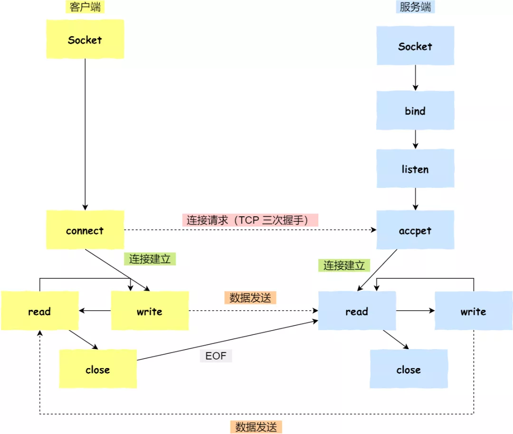

### 1、CPU调度


### 2、进程同步

> 为什么要引入进程同步？

在多道程序环境下，进程是并发执行的，不同进程之间寻存在着不同的制约关系，**为了协调进程之间的制约关系，引入了进程同步的概念**。进程同步涉及到以下概念：

- 临界资源：一次仅允许一个进程使用的资源；访问临界资源的那段代码叫【临界区】
- 同步：同步是指协调进程间的工作次序关系、传递信息所产生的制约关系；
- 互斥：互斥是指当一个进程持有临界资源的时候，其他进程必须等待；当持有临界资源的进程退出临界区后，其他进程才能使用临界资源。

> 同步机制需要注意哪些准则？

1）空闲让进：

2）忙则等待：

3）有限等待：

4）让权等待：

#### 2.1、实现临界区互斥

> 实现临界区互斥有哪些方法？

实现进程间在临界区**互斥**的方法可以分为软件方法和硬件方法

- 软件实现方法
  1. 单标志算法
  2. 双标志法先检查
  3. 双标志法后检查
  4. 皮特森算法
- 硬件实现方法
  1. 中断屏蔽
  2. 硬件指令：TestAndSet或Swap

#### 2.2、信号量

> 操作系统什么机制可以解决互斥和同步问题？

- 信号量：提供PV操作的原语。P操作理解为获取锁，V操作理解为释放锁。
  1. 整型信号量：不断尝试获取信号量，采用【忙等待】，不会【让权等待】
  2. 记录型信号量：获取不到信号量的进程被放入到等待队列，让出CPU，不会忙等待。

> 使用信号量如何实现同步、互斥？

将信号量的初值设为1，同于【互斥】的时候，信号量就相当于一把锁；

> 原语是如何实现的？

原语是完成某种功能且不可分割、不可被中断的操作序列，通常由硬件实现；也可用软件实现，如中断屏蔽。

#### 2.3 管程

> 什么是管程？

信号量的PV操作都需要程序员自己实现，操作不当就容易死锁，【管程】可以理解为，是对共享资源和操作共享资源的封装，提供操作共享资源的接口，用于进程间的同步和互斥。

> 条件变量是不是管程？条件变量和信号量有什么区别？

条件变量包含在管程的实现当中，条件变量不等于管程。

管程将条件变量定义为：进程进入管程后被阻塞，阻塞原因就是条件变量，条件变量不满足，所以进程被阻塞、进入等待。条件变量不是一个实际存在的变量。

管程内部可以设置多个条件变量，每个条件变量仅实现为一个等待队列x，用于记录阻塞在该条件变量上的所有进程；条件变量只有2种操作：x.wait 和 x.signal。

条件变量和信号量相比：信号量是“有值的”，表示剩余资源数；而条件变量是没有值的，条件变量就是一个等待队列。管程中用【共享数据结构】来表示剩余资源数，不一定是信号量。

#### 2.4 经典同步问题

> 有哪些经典的同步问题？

- 生产者-消费者问题
- 读者-写者问题

  1. 读者优先
  2. 写者优先
- 哲学家进餐问题：如何避免死锁和饥饿

  - 同时拿起2根筷子，即左右2个筷子都可以用的时候才拿起

  - 按照某种规则拿筷子，避免饥饿和死锁
    1. 对哲学家进行编号，要求奇数号的哲学家先拿左边的筷子，再拿右边的筷子；同时要求偶数号的哲学家先拿右边的筷子，再拿左边的筷子。
    2. 至多允许n-1位哲学家同时进餐

- 吸烟者问题


### 3、死锁

#### 3.1 死锁的原因和条件？

> 什么是死锁？产生死锁的原因是什么？死锁的必要条件是什么？

所谓死锁，是指多个进程因竞争资源而造成的一种僵局（互相等待），若无外力推动，这些进程都将无法向前推进。

产生死锁的原因：

- 系统资源的竞争：**资源有限且不可抢占**【这是大前提】，可抢占的资源竞争是不会陷入死锁的；
- 进程推进顺序非法：进程运行过程，请求和释放资源的顺序不当也会导致死锁；

产生死锁的必要条件（**同时满足以下4个**）：

1. **互斥的条件**：资源有限，且是互斥的；
2. **不可抢占的条件**：进程获取资源之后，除非使用完主动释放，否则不能被其他进程夺走；
3. **请求并保持的条件**：进程持有了至少一个资源，然后又请求其他新的资源，而新的资源已经被其他进程持有，进程阻塞且不释放已占有的资源；
4. **循环等待的条件**：存在一种进程资源的循环等待链，链中每个进程已获得的资源同时被链中下个进程所请求。

循环等待只是死锁的必要条件

#### 3.2 如何预防死锁？

> 如何预防死锁？从死锁的4个必要条件出发，要预防死锁，就要破坏4个必要条件之一

通过设置某些限制条件，破坏死锁的4个必要条件的一个或几个，从而防止发生死锁。

1. 破坏互斥条件：系统资源一般是无法同时共享的，所以破坏互斥条件是【不可行的】；
2. 破坏不可抢占条件：当一个持有某些不可抢占资源的进程请求新的资源而得不到时，进程释放掉持有的全部资源，待以后重新申请。【导致进程前部分工作实效；增加系统开销，降低系统吞吐量】
3. 破坏请求并保持条件：预先静态分配资源，进程在运行之前一次性申请需要的全部资源，资源没有全部满足时不运行；【可能导致饥饿】，可能个别资源被长期占用，其他需要该资源的进程长期无法运行。
4. 破坏循环等待条件：为每一种资源编号，规定进程必须按照编号递增的顺序来请求资源，同类资源一次性申请完。即进程申请R1类资源，下次只能申请R2类资源，无法重复申请R1类资源；

#### 3.3 如何避免死锁？

> 死锁避免策略是如何避免发生死锁的？ 死锁避免和死锁预防有什么区别？

死锁避免同样属于事先预防策略，但与【死锁预防】不同的是，【死锁避免】并非通过破坏【死锁必要条件】，而是在资源分配之前，检查是否会陷入【系统不安全状态】来决定此次分配能不能进行，从而避免死锁。

【安全状态】是指系统能按照某种【进程推进顺序】（P1, P2, P3,,,,Pn）为每个进程Pi分配所需资源，直到满足每个进程对资源的最大需求，使每个进程都能顺利运行完成。此时的（P1, P2, P3,,,,Pn）称为【安全序列】。如果无法找到一个【安全序列】，那么系统处于【不安全状态】

所以，是否存在一个【安全序列】是检查系统是否安全的充分必要条件。

> 著名的死锁避免算法——银行家算法


#### 3.4 如何检测并解除死锁？


### 4、互斥和同步的实现

> 同步互斥的方式主要有哪些？

#### 4.1自旋锁和互斥锁

> 锁的基本处理方式可以分为忙等待（自旋锁）和非忙等待（互斥锁）这两种，其他形式的锁都是这两种的高级实现。

- 忙等待锁，也叫 自旋锁，利用CPU时间片一直自旋，直到获得锁。自旋的线程即使获取不到锁也不会放弃CPU，所以说是忙等待。自旋锁在单核CPU上必须是基于可抢占的调度，否则持有自旋锁的线程不会让出CPU，就会一直自旋。

  - 如原子操作指令 Test-And-Set，设置新值返回旧值

  - CAS，Compare And Swap，由CPU提供，在【用户态】完成加锁和解锁操作；CAS将加锁的两个步骤合起来作为一个原子指令：

    1. 查看锁的状态，如果锁是空闲的，则执行第2步
    2. 将锁设置为当前线程战友

    

- 非忙等待，互斥锁，与忙等待相反，当线程获取不到锁的时候，主动让出CPU；系统将线程放入到锁的等待队列中，CPU调度其他线程。

> 什么时候适合使用自旋锁，而不是互斥锁？

考虑一下互斥锁加锁失败带来的性能开销：

- 互斥锁加锁失败时，会从用户态陷入到内核态，内核执行线程切换和调度，由此会有2次上下文切换的成本
  1. 加锁失败，线程从【运行态】转为【睡眠态】，让出CPU
  2. 获得锁，线程从【睡眠态】转为【就绪态】，就绪调度的时候把CPU交给线程，切换回【运行态】

- 如果能够确定临界区执行的时间很短，甚至都短于上下文切换的时候，就可以考虑使用自旋锁而不用互斥锁。


#### 4.2 读写锁

> 什么是读写锁？什么时候应该使用读写锁？

读写锁就是具有读锁和写锁的特殊锁，读写锁适用于可以明确区分读和写的场景。读写锁的工作原理

- 当【写锁】没有被线程持有时，多个线程能够并发地持有【读锁】；所以【读锁】是共享锁；
- 当【写锁】被某个线程持有后，线程获取【读锁】就会被阻塞，线程获取【写锁】也会陷入阻塞，所以【写锁】是独占锁。

可见，**在读多写少的场景下，使用读写锁能够发挥优势。**

> 说说 读优先和写优先分别是什么？什么是公平的读写锁？

- 读优先锁：就是优先读，当一个线程持有【读锁】之后，尝试获取【写锁】的线程就陷入阻塞；同时，如果还有其他线程获取【读锁】，这些线程会优先于请求【写锁】的线程。这样也可能导致【写线程】饿死。
- 写优先锁：就是优先写，与读优先相反，写优先可能导致【读线程】饿死。
- 公平的读写锁：采取先到先服务的原则，将请求读写锁的线程排队，按照FCFS的原则获得读写锁，保证公平，不会饿死。

> 经典同步问题：读者和写者问题？


#### 4.3 乐观锁和悲观锁

> 什么是悲观锁？什么是乐观锁？

悲观锁认为，多线程共享冲突的概率比较高，所以访问共享资源之前，必须**先上锁**。所以，诸如自旋锁、互斥锁、读写锁等，都是悲观锁。

乐观锁认为，先假定多线程共享冲突的概率比较低，所以不加锁，让多个线程同时访问共享资源；当数据提交的时候才通过一种机制来验证是否发生数据冲突（一般是通过版本号对比，如SVN和Git的修改冲突对比）

乐观锁本身不对共享资源加锁，访问共享资源的时候是无锁状态；通过业务逻辑实现锁的功能，如版本号对比。

乐观锁并不是全程加锁，所以也叫【无锁编程】。应用如：在线共享文档、Git分布式提交。

- 悲观锁：
- 乐观锁


### 5、进程间通信

由于每个进程空间都是相互独立的，不能相互访问，而内核空间是每个进程共享的，所以进程间通信可以通过内核 作为中介来实现，如管道、消息队列，但是这类通信方式都需要在用户空间和内核空间来回拷贝数据，效率较低，不利于大块数据的通信；共享内存实现了无须内核空间的参与也能实现进程间数据共享；

> 进程间通信的方式有哪些？分别举例应用场景




- 管道
- 消息队列
- 共享内存
- 信号量
- 信号
- Socket

#### 5.1 管道

> 什么是匿名管道和命名管道，有什么区别？

管道是一种文件，可以调用read、write和close等操作文件的接口来操作管道；另一方面管道又不是一种普通的文件，它属于一种独特的文件系统：`pipefs`。管道的本质是**内核**维护了一块缓冲区与管道文件相关联，对管道文件的操作，被内核转换成对这块缓冲区内存的操作。

管道传输的是无格式的数据流，且大小有限。

不管是匿名还是命令管道，本质都是一种特殊的文件系统 `pipefs`

```bash
# cat /proc/filesystems | grep pipefs
nodev   pipefs
```


- **匿名管道**，也就是没有名字的，在代码中使用`int pipe(int fd[2])`接口创建的，使用文件描述符进行读写操作，因此，只有那些能看到文件描述符的进程才能使用该管道，一般是**具有父子关系的进程间通信**。

  **匿名管道是由进程创建的，其生命期跟随进程。**

  1. 进程fork产生子进程，子进程拷贝了父进程所打开的文件描述符，此时也建立了父进程和子进程的管道通信；但是父、子进程仍只能单向通信，需要分别在父、子进程把管道的读（写）关掉。
  2. shell command “|” 就是常见的管道，其工作原理如下图，进程A和B同时fork自shell进程：

  

  

- **命名管道**，也就是有名字，使用前用shell command：`mkfifo`创建并指定管道名字；命令管道是系统全局的管道，意味着**任何两个不相关的进程都可以进行通信**；

  ```bash
  ---- 
  mkfifo my_pipe
  echo "hello world" > my_pipe  // stuck here, wait for reading
  
  ---- in another shell ----
  cat < my_pipe					//read from my_pipe
  
  -----
  ```

#### 5.2 消息队列

管道的通信效率较低，会有一端存在阻塞；消息队列则可以异步地发送、读取数据，进程A发送数据到MQ就可以返回了，不被阻塞。

> 什么是消息队列？消息队列如何工作？

消息队列是保存在**内核**中的消息链表，由内核维护管理。进程发送给MQ的消息体别放入到队列，如有进程读取了该消息体，就把它从队列中删除。

消息队列是系统范围的，其生命周期跟随内核，如果没有释放消息队列或者没关闭操作系统，MQ就一直存在。

> 使用消息队列和管道通信分别需要在内核空间和用户空间进行多少次拷贝？

都是2次：从用户空间拷贝到内核缓冲区，从内核缓冲区拷贝到用户空间；管道有`4K`大小的限制，消息队列也有最大数据的限制。

> Android的Binder通信是一次拷贝。你了解吗？


#### 5.3 共享内存

> 共享内存的工作机制？

虚拟内存机制下，进程A和进程B都有自己的虚拟内存空间，由页表将虚拟地址控制映射到物理地址空间；共享内存地址，就是分别在进程A和进程B拿出一块虚拟地址空间，将它们映射到同一块物理内存空间，这样，进程A/B写入的数据，在另一个线程马上就能看到，不涉及用户/内核空间的拷贝。

> 如何同步进程对共享内存的读写？

共享资源显然是需要同步互斥的，进程间同步互斥的工具都适用。


#### 5.4 信号量 semaphore

信号量可以理解为整型的计数器，它的实现有两部分，一个整数+一个阻塞队列，整数值可以代表一类资源的个数，当资源被拿光了，再去拿的进程就会陷入阻塞，被挂到信号量的阻塞队列上。

与信号量相关的是著名的`P/V`操作，P操作可能会陷入阻塞，V操作不会阻塞。

- 当信号量的值初始化  > 1的时候，表征资源个数；
- 当信号量的值初始化为1/0，则该信号量就是互斥信号量，可用于保证同时只能有一个进程使用共享资源；


#### 5.5 信号 signal

> 信号和信号量的区别？

信号是操作系统中的各种信号，如中断信号

```bash

# kill -l
 1) SIGHUP       2) SIGINT       3) SIGQUIT      4) SIGILL       5) SIGTRAP
 6) SIGABRT      7) SIGBUS       8) SIGFPE       9) SIGKILL     10) SIGUSR1
11) SIGSEGV     12) SIGUSR2     13) SIGPIPE     14) SIGALRM     15) SIGTERM
16) SIGSTKFLT   17) SIGCHLD     18) SIGCONT     19) SIGSTOP     20) SIGTSTP
21) SIGTTIN     22) SIGTTOU     23) SIGURG      24) SIGXCPU     25) SIGXFSZ
26) SIGVTALRM   27) SIGPROF     28) SIGWINCH    29) SIGIO       30) SIGPWR
31) SIGSYS      34) SIGRTMIN    35) SIGRTMIN+1  36) SIGRTMIN+2  37) SIGRTMIN+3
38) SIGRTMIN+4  39) SIGRTMIN+5  40) SIGRTMIN+6  41) SIGRTMIN+7  42) SIGRTMIN+8
43) SIGRTMIN+9  44) SIGRTMIN+10 45) SIGRTMIN+11 46) SIGRTMIN+12 47) SIGRTMIN+13
48) SIGRTMIN+14 49) SIGRTMIN+15 50) SIGRTMAX-14 51) SIGRTMAX-13 52) SIGRTMAX-12
53) SIGRTMAX-11 54) SIGRTMAX-10 55) SIGRTMAX-9  56) SIGRTMAX-8  57) SIGRTMAX-7
58) SIGRTMAX-6  59) SIGRTMAX-5  60) SIGRTMAX-4  61) SIGRTMAX-3  62) SIGRTMAX-2
63) SIGRTMAX-1  64) SIGRTMAX

```

- 信号事件的来源：硬件来源（键盘）和软件来源（kill命令，或异常）
- 对信号事件的处理：
  1. 执行默认操作：操作系统对各种信号提供了默认操作，如果用户没有自定义处理函数。
  2. 捕捉信号：为信号自定义一个处理函数
  3. 屏蔽信号：可以选择屏蔽哪些信号


#### 5.6 Socket

socket的优势，除了同一个主机上的进程间通信，还可以通过网络实现不同主机间的进程间通信。

如基于TCP协议的socket编程模型：




参考：

1. https://www.cnblogs.com/zengyiwen/p/5755170.html
2. 