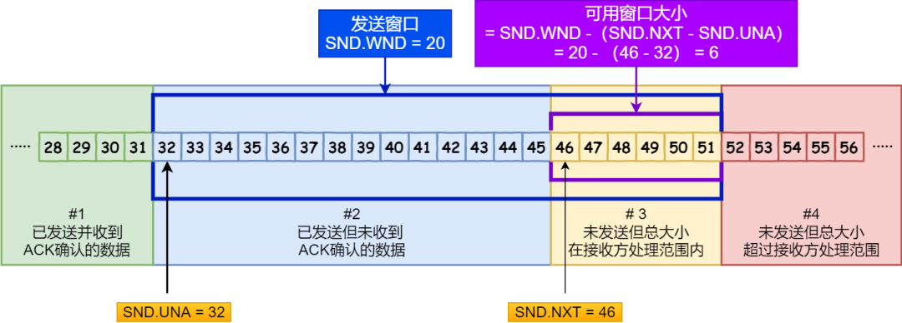

### 3、TCP连接管理

#### 3.1 三次握手

> TCP连接为什么是3次握手，为什么不是2次或者4次？

- 首先要知道3次握手分别做了什么事情。
  1. 第一次握手：客户端（随机序列号x、SYN）发送SYN报文;
  2. 第二次握手：服务端（随机序列号y，确认号x+1，SYN、ACK）发送ACK报文；实际是SYN和ACK合二为一；为该连接分配TCP缓存和变量；
  3. 第三次握手：客户端（序列号x+1，确认号y+1，ACK）；如携带数据则消耗序列号，否则序列号是x+1；为该连接分配TCP缓存和变量

- 为什么不是2次握手？

  1. 原因一：	避免历史重连。**首要原因是为了防止旧的重复连接初始化造成混乱**

     *考虑第一次握手的SYN报文网络阻塞，导致超时重传，然而旧报文还是比新报文先到达服务端，那么服务端就先响应旧报文的ACK，客户端拿到旧报文的ACK发现和新报文的不匹配，所以放弃该旧的连接请求，即发送**RST报文**来终止该连接。*

  2. 原因二：同步双方初始化序列号。

     *第三次握手向服务端发送确认ACK，表示收到服务端的序列号，这样一来双方的序列号才能可靠地建立起来。*

  3. 原因三：避免浪费资源。

     *如果没有第2次握手，服务端就无法知道客户端到底有没有收到第二次握手的ACK报文，这样服务端就只能保留预分配的TCP连接资源；如果第一次的SYN报文阻塞重传，那么服务端收到多个重复的SYN就会建立多个冗余的无效连接。*

- 为什么不是4次握手？

  因为3次握手就可以完成可靠的连接，所以不需要使用4次通信。

> 为什么TCP连接建立过程，服务器端容易受到SYN洪泛攻击？

- SYN洪泛攻击

因为服务端是在发出第2次握手的SYN/ACK报文的时候就准备TCP缓存和变量，如果客户端不断地发送SYN报文，就可能导致服务端不断地分配TCP缓存，最终导致缓存用尽。

> SYN攻击原理？

Linux内核为TCP连接维护两个队列：半连接队列（SYN队列）和全连接队列（Accept队列）

1）SYN攻击主要作用于SYN队列，不断发送SYN使得SYN队列被塞满，从而服务器无法正常工作。

2）如果应用程序不及时调用accept从Accept队列取出TCP连接，就会导致Accept被塞满，SYN队列中的半连接无法及时转移到Accept全连接队列，从而服务器也无法正常工作。

> 如何防御SYN洪泛？

- 防御SYN洪泛攻击

  1）控制SYN队列的大小，超过大小时丢弃（简单粗暴）

  2）SYN队列占满，启动cookie，后续接收到的SYN包不进入SYN队列


#### 3.2 四次挥手

注意客户端和服务端的状态转移

- 主动断开连接的那一段才有 TIME_WAIT 状态，从 TIME_WAIT 到 CLOSED 需要等待 2MSL 的时间
- MSL：Max Segment Lifetime 报文在网络中的最大生存时间

1）客户端 FIN：ESTABLISHED -> FIN_WAIT_1

2）服务端 ACK：ESTABLISHED -> CLOSED_WAIT；

3）服务端 FIN：CLOSED_WAIT -> LAST_ACK

4）客户端 ACK：FIN_WAIT_2 -> TIM_WAIT，TIME_WAIT --- SMSL --- > CLOSED

> 为什么需要4次挥手？

> 为什么TIME WAIT 需要 2MSL ？

> 为什么需要TIME WAIT 状态？

1）

2）保证连接正确地断开。TIME WAIT的作用是**等待足够的时间以确保最后的 ACK 能让被动关闭方接收，从而帮助其正常关闭。**


### 4、TCP可靠传输

> TCP通过哪些方式保证可靠传输？

#### 4.1 超时重传

- 校验：

- 序列号 + 确认应答：

- 重传

  1）超时重传：发送数据的时候，设定一个定时器，当超过定时时间还没有收到ACK应答确认报文，就重传该数据。

  1. 超时时间`RTO`应该设为多少？`RTO`应该略大与一次数据的往返时间`RTT`，网络速度总是在变化的，所以`RTO`也是动态变化的。`TCP`通过不断采样`RTT`的时间来计算一个平滑的`RTT`值。
  2. 遇到一次超时重传之后，如果相同报文还超时，就将超时时间设置为先前`RTO`的两倍；如果2次都超时，说明网络环境很差，不适合频繁重复发送。

  2）快速重传（冗余`ACK`）：超时重传需要等待的时间间隔相对较长，如果想马上识别到需要重传，就使用快速重传。

#### 4.2 快速重传

> 什么是累积确认？

累积确认是指，在发送当前应答确认报文`Ak`之前，`A1  - Ak-1`都应该应答确认。

对`r1, r2, r3, r4, ...., r10` TCP请求报文序列，如果接收端收到`r1,r2,r4,r5,r6`,，没收到`r3`，那么先缓存`r4, r5, r6` 但是应答确认还是发送 `ACK(r3)`表示要去下个报文发送`r3`，或者表示接受端已收到`ACK(r3)`前的全部数据，要求开始发送`r3`。

#### 4.3 选择性重传

> 快速重传（冗余ACK）如何确定哪些TCP报文需要重传？

快速重传（冗余ACK）有一个问题：如收到`r3`的3个冗余ACK，那么下一步如何确定是只重传`r3`，还是重传`r3`及其后续的全部TCP报文。

为了解决这个问题，TCP协议引入了`SACK`字段，需要双方都打开支持`net.ipv4.tcp_sack`。

- SACK，Selective ACK，选择性应答，即可以选择只需要重传的TCP报文，而不需要全部重传；接收端在应答确认报文的`sack`字段指出接收端当前缓冲了哪些数据序列，同时结合【确认序列号】字段，以此告诉发送端哪些数据序列不需要重传，从而只重传丢失的数据。
- D-SACK，Duplicate SACK，D-SACK这种机制也是基于SACK字段，结合【确认序列号】字段，告诉发送端，接收端收到了哪些重复的报文数据。需要双方打开`net.ipv4.tcp_dsack`

【重点】接收方需要结合【ACK】确认序列号来确定当前`SACK`表示的是接收端的缓存序列，还是重复发送的报文序列。

### 5、TCP滑动窗口

> 什么是滑动窗口？滑动窗口解决了什么问题？

TCP是每发送一个数据都需要接收方的应答确认，如果发送一个，确认应答一个，再发送下一个，再应答一个，显然效率是很低下的。为了解决这种效率低下的问题，引入滑动窗口，使得发送方一次能够发送多个，接收方一次能够接收多个，然后发送方和接收方都采取【累积确认】的模式。参见上面的【选择性重传】

- 发送窗口：发送端的发送窗口包括2部分的数据（槽）

  1. 已发送但未收到ACK确认的数据
  2. 未发送的但大小在接收方处理范围内的数据

  

- 接收窗口：接收窗口跟发送窗口不一样的，接收窗口是空的，等待发送窗口的数据发送过来

  1. 未收到数据但可以接收的数据空位
  2. 未收到数据并且还不可以结束的数据空位

  

  > 滑动窗口的大小是如何确定的呢？

  TCP报文的头部有一个16比特的【窗口大小】的字段，【接收端】使用该字段告诉【发送端】自己还有多少接收缓冲区可以用于接收数据，从而调整【发送端】的发送窗口。

  所以滑动窗口的大小是由【接收方】决定的。

  > 接收窗口和发送窗口的大小是相等的吗？

  两者不总是大小相等的。因为接收窗口和发送窗口的调整是存在延迟的，如果接收方处理得很快的时候，接收窗口很快可以空出来的，将这个新的窗口大小发送给【发送方】之前，发送方的窗口大小跟接收方是不一样的。

  

### 6、TCP流量控制

> 为什么需要做流量控制？

因为【接收方】处理能力有限，如果【发送方】发送太快，一直发一直发，但是接收方处理不过来，就会导致部分发送的TCP报文无法及时得到确认应答，从而触发【重传】，导致网络流量的浪费，而且网络中存在着无用的重复的数据包，也会造成网络拥塞。


### 7、TCP拥塞控制

> 拥塞控制的算法有哪些？拥塞控制过程是怎么变化的？

拥塞控制算法有如下（算是有4种吧）：

- 慢启动算法：`cwnd`指数增长到`ssthresh`

- 拥塞避免算法：`cwnd == ssthresh`触发进入拥塞避免算法，`cwnd`线性增长。

- 拥塞发生算法：网络开始出现拥塞，触发了重传机制（超时、或者受到3个冗余`ACK`），分别对应如下的处理方式：

  1）超时重传（等待ack超时）算法：发生了超时，说明网络确实拥塞。这时候需要调整`ssthresh`和`cwnd`

  ```c++
  ssthresh = cwnd/2;
  cwnd = 1;		//网络拥塞严重，拥塞窗口重新置为1，重新开始慢启动
  ```

  重新开始慢启动会突然减少数据流，即发送速率下降，反应强烈，可能造成网络的卡顿。

  

  2）快速重传  （受到3个冗余ack）+ 快速恢复：还能收到3个冗余ACK，说明网路还不那么拥塞，所以没必要把拥塞窗口重置为1；快速恢复算法认为拥塞窗口减小为一半就行，同时将`ssthresh`也变成`cwnd`的一半，使得`cwnd == ssthresh`触发【拥塞避免】算法，让`cwnd`线性增长。

  ```c++
  //1) cwnd = cwnd/2;
  //2) ssthresh = cwnd;
  //3) 进入快速恢复
  	// cwnd = ssthresh + 3  (不确定是不是有此标准)
  	// 重传丢失的数据包
  	// 如果再收到重复的ACK，那么 cwnd 增加 1
  	// 如果收到新数据的ACK，那么 cwnd 设置为 ssthresh，接着进入 拥塞避免算法
  ```

  快速恢复：

  有些书上讲解【快恢复】的过程，并没有1`cwnd = ssthresh+3`，而是由于`cwnd == ssthresh`直接进入拥塞避免，`cwnd`线性增长。

  

  


### 参考

1. [图解滑动窗口、流量控制、拥塞控制](https://mp.weixin.qq.com/s?__biz=MzUxODAzNDg4NQ==&mid=2247484017&idx=1&sn=dc54d43bfd5dc088e48adcfa2e2bc13f&scene=21#wechat_redirect)
2. 
3. 